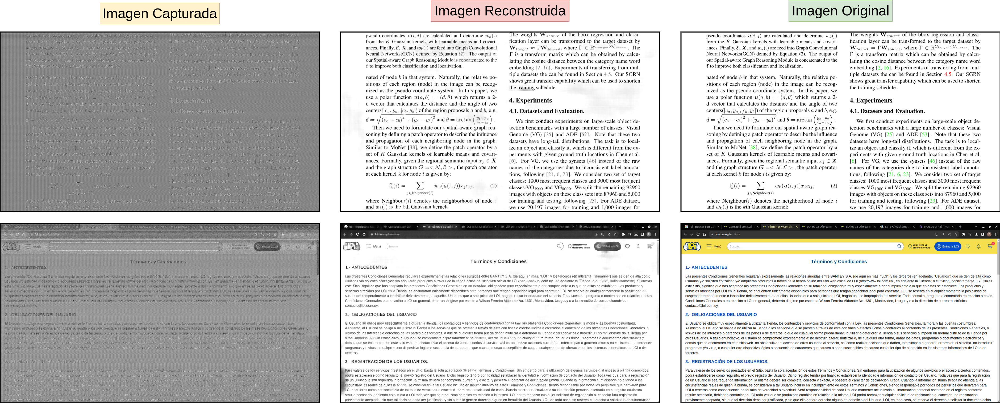
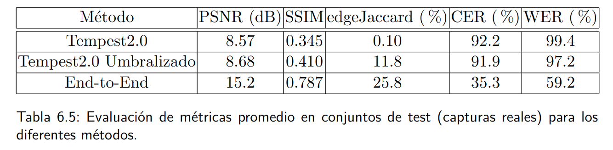

# Deep-tempest 2023


Este trabajo corresponde al Proyecto de Fin de Carrera titulado *deep-tempest* de la carrera Ingeniería Eléctrica para la Facultad de Ingeniería de la Universidad de la República.

Integrantes:
- Santiago Fernández
- Emilio Martínez
- Gabriel Varela

Tutores:
- Federico La Rocca
- Pablo Musé

## Resumen

Se extiende el proyecto [**gr-tempest**](https://github.com/git-artes/gr-tempest) (*espionaje a imágenes de monitores en GNU Radio*) utilizando *deep learning* para mejorar la calidad de las imágenes espiadas. El objetivo principal es recuperar el texto presente en la imagen capturada por el sistema espía.


## Resultados



Se evalúan las métricas **PSNR**, **SSIM**, **edgeJaccard** (*índice Jaccard entre los bordes de la referencia y de la reconstrucción*), **CER** y **WER** (*tasa de error en caracteres y palabras*) sobre la base de datos de capturas reales (1302 imágenes) son los de la siguiente tabla:



Más ejemplos se pueden ver en el directorio [deep-tempest_ejemplos](deep-tempest_ejemplos). 

También se pueden visualizar desde [este enlace](https://finguy-my.sharepoint.com/:f:/g/personal/emilio_martinez_fing_edu_uy/Eo_2mmNwq0lHguqmzjq7MyABb9pBbuDV3_EPOA9xGC-7vg?e=kevSbM) *(no estable)*. Aquí las imágenes están estructuradas con el siguiente orden:

1. Imagen original
2. Imagen espiada (_gr-tempest2.0_)
3. Imagen inferida por método _End-to-End_
4. Imagen inferida por método de _umbralización por máxima entropía_

## Datos

Los datos utilizados [este enlace](https://finguy-my.sharepoint.com/:u:/g/personal/emilio_martinez_fing_edu_uy/EZ8KpQHJ7GZBvMRsBMtNj6gBkC3Fvivuz87-1fiQS6WKiw?e=LVjajm) dentro de un archivo ZIP (~7GB). Al descomprimirlo se pueden encontrar las imágenes sintéticas y capturadas realizadas para los experimentos, entrenamiento y evaluación durante el trabajo.

La **estructura** de los directorios es **diferente** para los **datos sintéticos** es diferente al de los **capturados**:

### Datos sintéticos

* *ground-truth* (directorio con imágenes de referencia/vistas del monitor)
    - imagen1.png
    - ...
    - imagenN.png

* *simulations* (directorio con imágenes sintéticas de degradación/captura)
    - imagen1.png
    - ...
    - imagenN.png

### Datos reales 

* *Imagen 1* (directorio con capturas de imagen1.png)
    - captura1_imagen1.png
    - ...
    - capturaM_imagen1.png

* ...

* *Imagen N* (directorio con capturas de imagenN.png)
    - captura1_imagenN.png
    - ...
    - capturaM_imagenN.png

- imagen1.png
- ...
- imagenN.png

## Código y requerimientos

Clonar el repositorio (solicitar acceso al mismo):

```shell
git clone https://gitlab.fing.edu.uy/jorge.varela/deep-tempest.git
```

En cada una de los directorios se tiene una guía de cómo ejecutar las pruebas/entrenamiento/experimentos correspondientes. 

El código esta escrito en lenguaje Python versión 3.10, donde se utilizó ambientes de Anaconda. Para replicar el ambiente de trabajo crear uno nuevo con las bibliotecas del _requirements.txt_:

```shell
conda create --name deeptempest --file requirements.txt
```

Activarlo con:
```shell
conda activate deeptempest
```

## Referencias

- [gr-tempest](https://github.com/git-artes/gr-tempest)
- [Deep Plug and Play Image Restoration](https://github.com/cszn/DPIR/tree/master) (DPIR)
- Maxima entropía [código en Python](https://github.com/imadtoubal/Maximum-Entropy-Thresholding-Implementation-in-Python/blob/master/entropy_thresholding.ipynb)
