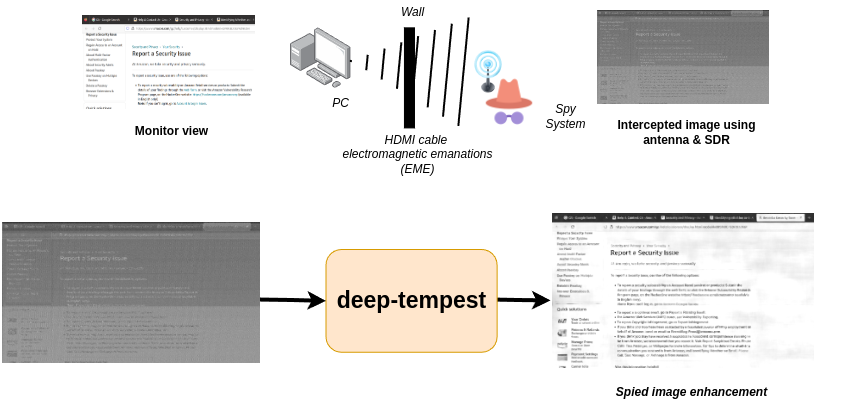
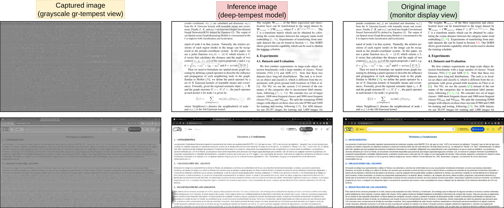

# Deep-tempest:  Using Deep Learning to Eavesdrop on HDMI from its Unintended Electromagnetic Emanations



## Summary

The [**gr-tempest**](https://github.com/git-artes/gr-tempest) project (*monitor image espionage in GNU Radio*) is extended using *deep learning* to improve the quality of the spied images. The main goal is to recover the text present in the image captured by the espionage system. 



## Video demo

Watch a video of the full system in operation below:

[! ](https://www.youtube.com/watch?v=ig3NWg_Yzag)

## Cite this work (TODO)

## Data

The data used can is available at [this dropbox link](https://www.dropbox.com/scl/fi/7r2o8nbws45q30j5lkxjb/deeptempest_dataset.zip?rlkey=w7jvw275hu8tsyflgdkql7l1c&st=e8rdldz0&dl=0) within a ZIP file (~7GB). After unzipping, you will find synthetic and real captured images used for experiments, training, and evaluation during the work. These images consists of 1600x900 resolution with the SDR's center frequency at the third pixel-rate harmonic (324 MHz).

The structure of the directories containing the data is **different** for **synthetic data** compared to **captured data**:

### Synthetic data

* *ground-truth* (directory with reference/monitor view images)
    - image1.png
    - ...
    - imageN.png

* *simulations* (directory with synthetic degradation/capture images)
    - image1_synthetic.png
    - ...
    - imageN_synthetic.png

### Real data

- image1.png (*image1 ground-truth*)
- ...
- imageN.png (*imageN ground-truth*)

* *Image 1* (directory with captures of *image1.png*)
    - capture1_image1.png
    - ...
    - captureM_image1.png

* ...

* *Image N* (directory with captures of *image1.png*)
    - capture1_imageN.png
    - ...
    - captureM_imageN.png

## Code and Requirements

Clone the repository:

```shell
git clone https://github.com/emidan19/deep-tempest.git
```

Both [gr-tempest](./gr-tempest/) and [end-to-end](./end-to-end/) folders contains a guide on how to execute the corresponding files for image capturing, inference and train the deep learning architecture based on DRUNet from [KAIR image restoration repository](https://github.com/cszn/KAIR/tree/master).

The code is written in Python version 3.10, using Anaconda environments. To replicate the working environment, create a new one with the libraries listed in [*requirements.txt*](./requirements.txt):

```shell
conda create --name deeptempest --file requirements.txt
```

Activate it with:
```shell
conda activate deeptempest
```

Regarding installations with GNU Radio, **it is necessary to follow the [gr-tempest](./gr-tempest/README.md) instructions in this repository** *(even if you have already installed gr-tempest at a different location)*. After this, run the following *grc* files flowgraphs to activate the *hierblocks*:
- [binary_serializer.grc](./gr-tempest/examples/binary_serializer.grc)
- [FFT_autocorrelate.grc](./gr-tempest/examples/FFT_autocorrelate.grc)
- [FFT_crosscorrelate.grc](./gr-tempest/examples/FFT_crosscorrelate.grc)
- [Keep_1_in_N_frames.grc](./gr-tempest/examples/Keep_1_in_N_frames.grc)

Finally run the flowgraph [deep-tempest_example.grc](./gr-tempest/examples/deep-tempest_example.grc) to capture the monitor images and be able to recover them with better quality using the *Save Capture* block.
