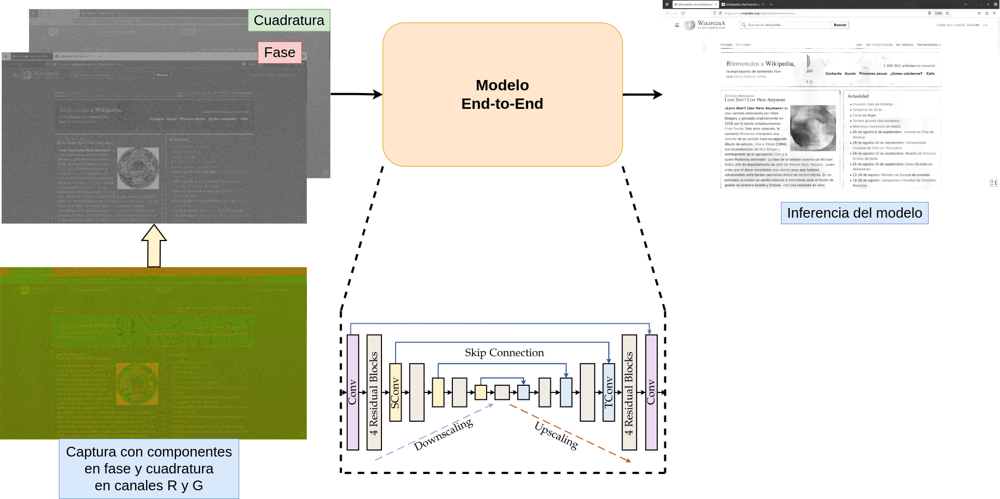

# Método End-to-End



## Guía de uso

A modo general, las opciones a usar (carpetas de imágenes de referencia/degradadas, modelos de la red, directorio de salida, etc) se encuentran en [end-to-end/options](../end-to-end/options).

### Inferencia y Evaluación

Para ejecutar la inferencia se debe editar el archivo [end-to-end/options/train_drunet.json](../end-to-end/options/train_drunet.json) y, una vez hechos los cambios, ejecutar:

```shell
python main_test_drunet.py
```
Este comando dará un directorio nuevo como salida con las inferencias del directorio de entrada.

Para ejecutar la evaluación de un directorio con imágenes se debe editar el archivo [end-to-end/options/evaluation.json](../end-to-end/options/evaluation.json) y, una vez hechos los cambios, ejecutar:
```shell
python tempest_evaluation.py
```

### Entrenamiento

**Nota: antes de ejecutar el siguiente comando se debe seleccionar qué tipo de datos usar para el entrenamiento**


```shell
python main_train_drunet.py
```

#### Entrenamiento con datos reales

Para entrenar con datos reales, el archivo [end-to-end/options/train_drunet.json](../end-to-end/options/train_drunet.json) debe tener en el campo __dataset_type__ (datasets-->train) el valor __"drunet_finetune"__.

#### Entrenamiento con datos sintéticos

Para entrenar con datos sinteticos, el archivo [end-to-end/options/train_drunet.json](../end-to-end/options/train_drunet.json) debe tener en el campo __dataset_type__ (datasets-->train) el valor __"drunet"__.